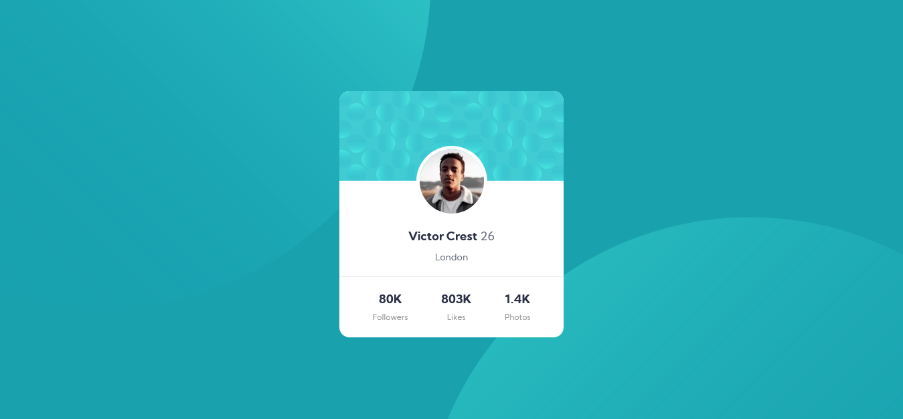

# Frontend Mentor - Profile card component solution

This is a solution to the [Profile card component challenge on Frontend Mentor](https://www.frontendmentor.io/challenges/profile-card-component-cfArpWshJ). Frontend Mentor challenges help you improve your coding skills by building realistic projects! 

## Table of contents

- [Overview](#overview)
  - [The challenge](#the-challenge)
  - [Screenshot](#screenshot)
  - [Links](#links)
- [My process](#my-process)
  - [Built with](#built-with)
  - [What I learned](#what-i-learned)
  - [Continued development](#continued-development)
  - [Useful resources](#useful-resources)
- [Author](#author)

## Overview

### The challenge

- Build out the project to the designs provided

### Screenshot



### Links

- Solution URL: [Click here](https://www.frontendmentor.io/solutions/profile-card-html-sass-bem-zfevFfH7g)
- Live Site URL: [See live site here](https://juanbonilla.me/FEM_profile-card-component/)

## My process

### Built with

- Semantic HTML5 markup
- CSS / SASS custom properties
- Flexbox
- Mobile-first workflow
- BEM Methodology

### What I learned

I had some issues trying to figure out how I could position the profile photo right in the middle of the card. So I decided to use this scss code, using calc and my variable that contains the photo size, then I added 10 due to the border (because it had 5px on each side) and obtained its half total. Once I calculated this value, I finally got a perfect centered photo. 

```scss
.card__photo {
  /* Other properties... */
  left: calc(50% - #{($photo-size + 10) / 2});
}
```

### Continued development

I found useful to continue working with BEM and SASS. Also, I want to improve my design from mobile-first to desktop view. In addition, I had never design with two background images in mind, in this case it was a trouble but now I get an idea of how to deal with this scenario.

### Useful resources

- [BEM explained with an example](https://www.youtube.com/watch?v=bvnzyXGkNY4&t=1555s) - This well explained video showed me how to get a better understanding of BEM and how to use it in my projects.

## Author

- Website - [juanbonilla.me](https://juanbonilla.me)
- Frontend Mentor - [@juanpb96](https://www.frontendmentor.io/profile/juanpb96)
- LinkedIn - [Juan Bonilla](https://www.linkedin.com/in/juan-pablo-bonilla-6b8730115/)


